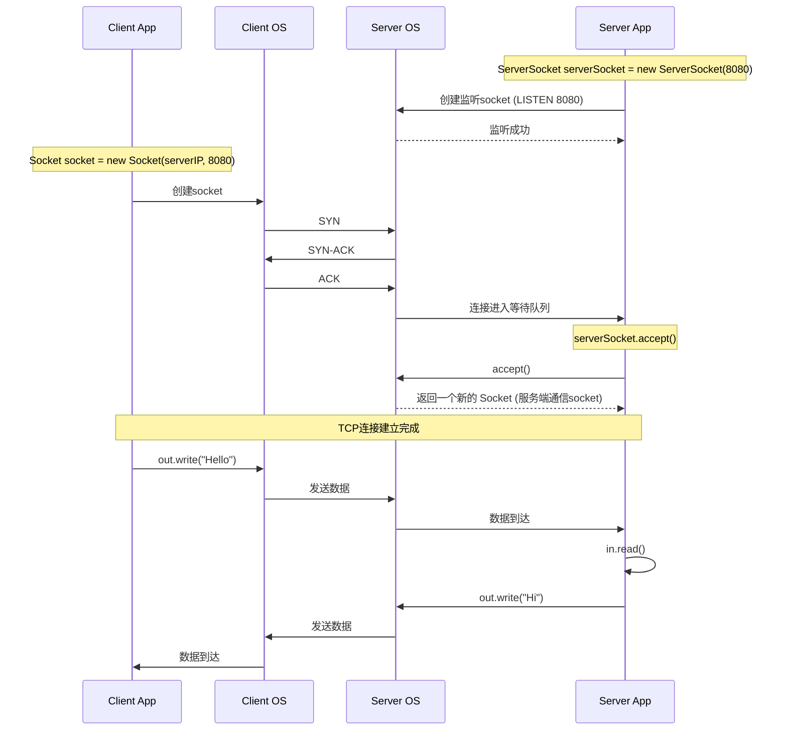

# concurrent-engine

jps -l：获取pid

jstack <pid>监听jvm

内存是否泄露
= 是否需要
\+ 生命周期是否合理
\+ GC是否能回收
\+ 数量是否受控

假泄露

### 1️⃣ 缓存未设置上限

- 看起来像泄漏
- 实际是无界缓存

### 2️⃣ 线程池队列过大

- 队列里任务对象堆积
- GC 无法回收
- 不是泄漏，是“背压失效”

### 3️⃣ ThreadLocal 未清理

- 真泄漏
- 非常隐蔽
